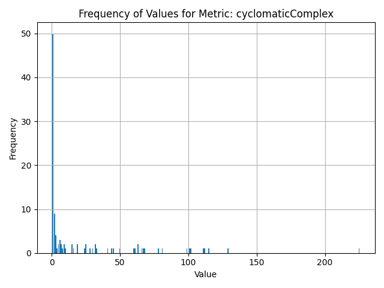
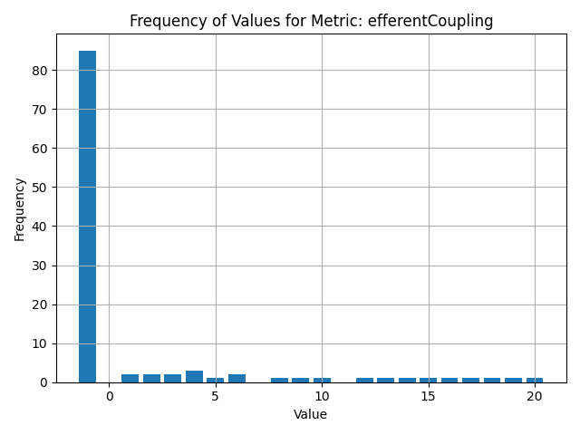

# ChatBot for Architecture

## What Problem Will Be Solved

We're addressing the challenge of ensuring that your architecture is up to date and that engineers avoid mistakes when developing an application. The ChatBot will respond based either on the context provided (such as code files shared by the user) or on files with detected issues, intelligently retrieved by our system based on metrics.

## Why AI for Architecture?

### Key Benefits:
- **Accelerated Design Process:** It's easier to design when you have an on-demand assistant trained in architectural best practices.
- **Smart Recommendations:** AI-driven suggestions based on best practices, regulations, and current project files.
- **24/7 Availability:** Instant architectural consultation at any time—especially helpful for junior developers who often need more guidance.

## Technology Stack

- **AI/ML:** OpenAI Model API  
- **Backend:** Python with Flask and LangChain  
- **Frontend:** Visual Studio Code Extension  
- **Database:** PostgreSQL – to be implemented  

## Data Overview

### Data Type

The dataset consists of `.java` source files containing classes specifically designed to exemplify various poor coding practices and software design anti-patterns.

---

### Dataset Volume

The current collection comprises approximately ~120 distinct class examples, each crafted to illustrate specific instances of suboptimal or erroneous coding techniques.

---

### Data Distribution

The dataset includes erroneous or problematic code examples, categorized as follows within:  
   
1. the `georgi-data` subset:  

| Category                                                               | Number of Examples | Percentage  |
| ---------------------------------------------------------------------- | ------------------ | ----------- |
| Architectural Issues / Design Flaws                                    | 16                 | 22.22%      |
| SOLID Principle Violations                                             | 9                  | 12.50%      |
| Code Smells                                                            | 24                 | 33.33%      |
| Exception Handling & Robustness                                        | 6                  | 8.33%       |
| Encapsulation & OOP Issues                                             | 6                  | 8.33%       |
| Looping, Logic & Control Flow Errors                                   | 3                  | 4.17%       |
| Resource Management                                                    | 2                  | 2.78%       |
| Comments & Documentation                                               | 1                  | 1.39%       |
| Other / Miscellaneous                                                  | 5                  | 6.94%       |

2. the `eca-data` subset:  

| Category                                                               | Number of Examples | Percentage  |
| ---------------------------------------------------------------------- | ------------------ | ----------- |
| Architectural Issues / Design Flaws                                    | 9                  | 29.03%      |
| SOLID Principle Violations                                             | 5                  | 16.13%      |
| Code Smells                                                            | 14                 | 45.16%      |
| Exception Handling & Robustness                                        | 2                  | 6.45%       |
| Encapsulation & OOP Issues                                             | 7                  | 22.58%      |
| Looping, Logic & Control Flow Errors                                   | 1                  | 3.23%       |
| Resource Management                                                    | 0                  | 0.00%       |
| Comments & Documentation                                               | 0                  | 0.00%       |
| Other / Miscellaneous                                                  | 0                  | 0.00%       |

3. the `claudiu-data` subset:  

| Category                                                               | Number of Examples | Percentage  |
| ---------------------------------------------------------------------- | ------------------ | ----------- |
| Architectural Issues / Design Flaws                                    | 4                  | 22.22%      |
| SOLID Principle Violations                                             | 2                  | 11.11%      |
| Code Smells                                                            | 2                  | 11.11%      |
| Exception Handling & Robustness                                        | 2                  | 11.11%      |
| Encapsulation & OOP Issues                                             | 2                  | 11.11%      |
| Looping, Logic & Control Flow Errors                                   | 2                  | 11.11%      |
| Resource Management                                                    | 2                  | 11.11%      |
| Comments & Documentation                                               | 0                  | 0.00%       |
| Other / Miscellaneous                                                  | 2                  | 11.11%      |

## Performance Metrics Monitored

### Cyclomatic Complexity  
Measures the number of independent paths through code; higher values indicate more complex logic.

### Cognitive Complexity  
Quantifies how difficult code is to understand by humans, beyond just control flow structures.

### Weighted Methods per Class (WMC)  
Sums the complexity of all class methods; indicates effort to maintain or understand the class.

### Lack of Cohesion in Methods (LCOM)  
Measures how related class methods are via shared fields; high LCOM implies poor class design.

### Afferent Coupling (Ca)  
Counts how many other classes depend on a given class; high Ca means high responsibility.

### Efferent Coupling (Ce)  
Counts how many classes a given class depends on; high Ce implies high external reliance.

### Tight Class Cohesion (TCC)  
Ratio of directly connected method pairs via shared attributes; high TCC means strong internal cohesion.

### Instability (I)  
Defined as Ce / (Ca + Ce); indicates how prone a module is to change under external influence.

## Current Status

Development – early stages

## Roadmap

- **Phase 1:** Basic conversational AI for architectural queries  
- **Phase 2:** Integration with metrics for every file scanned upon modification  
- **Phase 3:** Retrieval from a vector database for suggestions based on metrics  
- **Phase 4:** Implementation of smart and manual document retrieval to provide additional context to the ChatBot  

## Our Team

Meet the team behind **ChatBot for Architecture**:

---

### 👤 Dobrescu Andrei-Paul
**Role:** Team Lead

**Bio:** Student at BBU enjoy working with a lot of different systems. Integrating Ai in as many places as I can :)).

**Links:**  
- [🔗 LinkedIn](https://linkedin.com/in/username1)  
- [💻 GitHub](https://github.com/username1)

---

### 👤 Cărbune Ecaterina 
**Role:** Data analyst  

**Bio:** Student at Babeș-Bolyai University

**Links:**  
- [🔗 LinkedIn](https://www.linkedin.com/in/ecaterina-carbune-67061b339)  
- [💻 GitHub](https://github.com/Ec4ter1)

---

### 👤 Asandei Georgiana  
**Role:** AI Data Engineer (Code Analysis)  

**Bio:** I am a curious and passionate programmer who enjoys sunny days and bike rides, currently studying CS at BBU.

**Links:**  
- [🔗 LinkedIn](https://linkedin.com/in/georgiana-asandei-079597293)  
- [💻 GitHub](https://github.com/geoqiq)

---

### 👤 Drăghiță Claudiu - Ionuț
**Role:**  TypeScript Developer (AI Tooling)

**Bio:** Student passionate about AI and developing useful applications.

**Links:**  
- [🔗 LinkedIn](https://www.linkedin.com/in/claudiu-dr%C4%83ghi%C8%9B%C4%83-a39199295/) 
- [💻 GitHub](https://github.com/claudiu28)

## Contact

For inquiries or collaborations, reach out to us at: **dobrescuandreipaul@yahoo.com**

## Vizualizări pentru metrici

### Afferent Coupling

### Cognitive Complexity

### Cyclomatic Complexity

### Efferent Coupling

### Lack of Cohesion in Methods (LCOM)

---

**Transforming Architecture with AI**  
© 2025 ChatBot for Architecture
